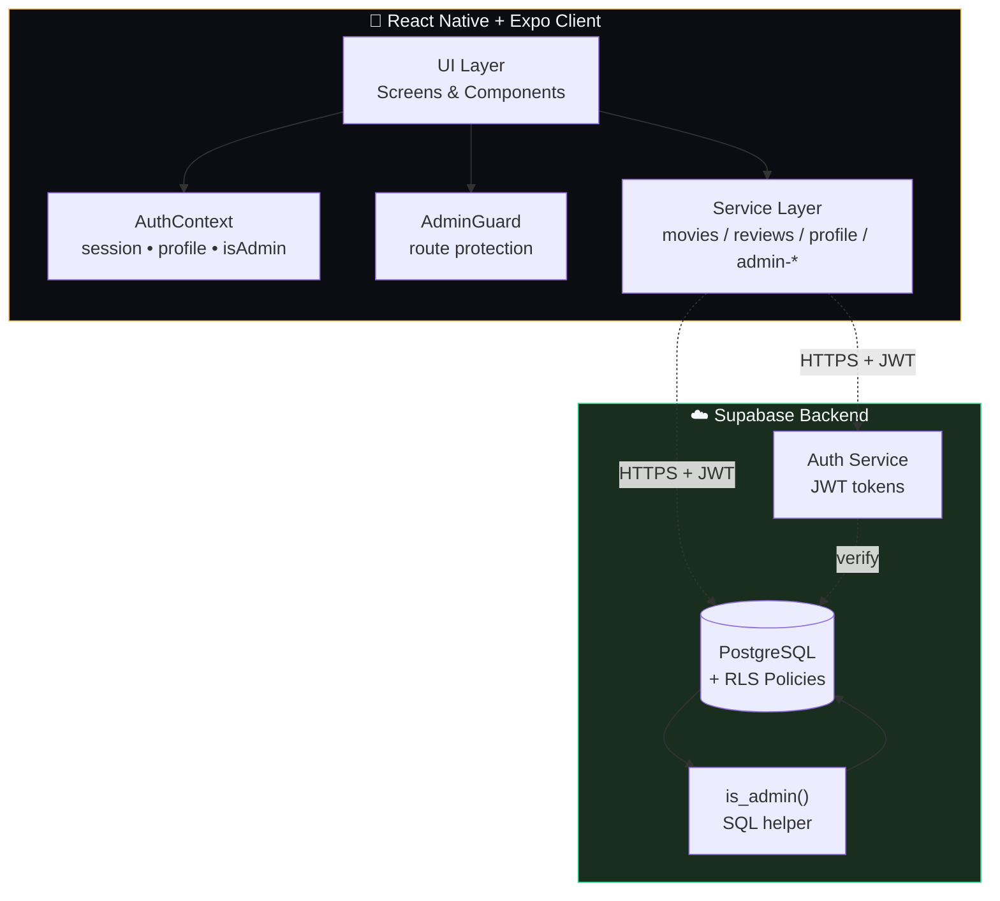
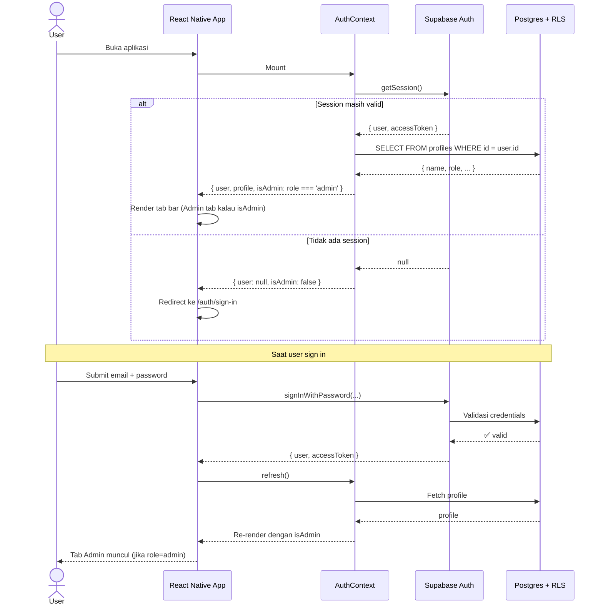

<div align="center">

# 🎬 MovieReview

**Aplikasi mobile review film cross-platform dengan admin panel terpadu**

[](https://expo.dev/)
[](https://reactnative.dev/)
[](https://www.typescriptlang.org/)
[](https://supabase.com/)
[](#-lisensi)

*Tugas Mata Kuliah — **Mobile App Development***

[Demo](#-demo--screenshots) • [Fitur](#-fitur) • [Arsitektur](#-arsitektur) • [Cara Menjalankan](#-cara-menjalankan) • [Pola Engineering](#-pola-engineering)

</div>

---

## ✨ Sorotan

> 🚀 **Production-grade patterns** — Stale-while-revalidate, optimistic UI dengan rollback, generation counter untuk async safety
>
> 🔒 **Database-level security** — Row-level security (RLS) dengan privilege escalation guard yang tidak bisa di-bypass dari client
>
> 🎯 **Type-safe end-to-end** — TypeScript strict mode, zero linting errors, full Supabase typing
>
> ⚡ **Polished UX** — Smooth animations dengan Reanimated, debounced search, error states dengan retry, modal flows yang ringan

---

## 📑 Daftar Isi

- [Demo & Screenshots](#-demo--screenshots)
- [Fitur](#-fitur)
- [Tech Stack](#-tech-stack)
- [Arsitektur](#-arsitektur)
- [Database Schema](#-database-schema)
- [Authentication Flow](#-authentication-flow)
- [Struktur Project](#-struktur-project)
- [Cara Menjalankan](#-cara-menjalankan)
- [Pola Engineering](#-pola-engineering)
- [Statistik Project](#-statistik-project)
- [Scripts](#-scripts)
- [Acknowledgments](#-acknowledgments)
- [Lisensi](#-lisensi)

---

## 🎥 Demo & Screenshots

> Tambahkan screenshot dan demo GIF setelah build production. Letakkan file di folder `docs/screenshots/`.

<table>
  <tr>
    <td align="center"><b>Home</b></td>
    <td align="center"><b>Detail Film</b></td>
    <td align="center"><b>Tulis Review</b></td>
  </tr>
  <tr>
    <td><i>docs/screenshots/home.png</i></td>
    <td><i>docs/screenshots/detail.png</i></td>
    <td><i>docs/screenshots/review.png</i></td>
  </tr>
  <tr>
    <td align="center"><b>Admin Hub</b></td>
    <td align="center"><b>Manage Movies</b></td>
    <td align="center"><b>Moderate Reviews</b></td>
  </tr>
  <tr>
    <td><i>docs/screenshots/admin-hub.png</i></td>
    <td><i>docs/screenshots/admin-movies.png</i></td>
    <td><i>docs/screenshots/admin-reviews.png</i></td>
  </tr>
</table>

---

## 📖 Ringkasan

MovieReview adalah aplikasi mobile yang memungkinkan pengguna untuk menemukan film, menulis review lengkap dengan rating dan tag, membangun watchlist pribadi, dan berinteraksi dengan katalog film yang terkurasi. Pengguna dengan role admin mendapat akses tambahan berupa control panel untuk mengelola katalog film dan memoderasi review yang dikirim user.

Project ini mendemonstrasikan pola pengembangan mobile production-grade: integrasi Supabase yang ter-typing rapi, row-level security, optimistic UI dengan rollback, paginated list, debounced search, serta role-based access control dengan navigasi tersembunyi.

---

## 🎯 Fitur

### Untuk Semua Pengguna
- **Autentikasi** — Sign up & sign in dengan email/password lewat Supabase Auth
- **Manajemen Profile** — Edit nama, username, bio, avatar, dan genre favorit
- **Jelajah Film** — Search, filter berdasarkan genre, halaman detail dengan cast, sinopsis, dan rating agregat
- **Featured Carousel** — Pilihan kurasi di home screen dengan visual yang kaya
- **Tulis Review** — Beri rating (1–5 bintang), judul + body, tag opsional, flag spoiler
- **Watchlist** — Simpan film untuk ditonton nanti, lihat di list khusus
- **Satu Review per Film per User** — Bisa di-edit, history edit ditampilkan via `updatedAt`

### Untuk Admin (Tab Tersembunyi)
- **Admin Hub** — Statistik live (movies, reviews, featured count) + kartu quick action
- **CRUD Film** — Create, edit, delete film dengan validasi form lengkap
- **Toggle Featured** — Switch on/off optimistic langsung dari list
- **Slug-based ID** — Dikunci saat edit untuk mencegah referensi rusak
- **Preview Gambar Live** — URL poster + backdrop dengan fallback error
- **Moderasi Review** — Paginated queue, filter berdasarkan judul film, delete dengan konfirmasi
- **Indikator Spoiler** — Tanda visual pada review yang ditandai mengandung spoiler

### Keamanan
- **Row-level security (RLS)** di semua tabel — write admin di-enforce di level database, bukan hanya client-side
- **Privilege escalation guard** — Update profile secara eksplisit tidak bisa mengubah kolom `role`
- **Route Tersembunyi** — Non-admin tidak akan pernah melihat tab Admin; percobaan deep-link akan di-redirect ke home screen via `AdminGuard`

---

## 🛠️ Tech Stack

| Layer | Teknologi |
|---|---|
| **Framework** | [Expo](https://expo.dev) (SDK 54) + [Expo Router](https://docs.expo.dev/router/introduction/) (file-based routing) |
| **Bahasa** | TypeScript (strict mode) |
| **UI** | React Native 0.81, [react-native-reanimated](https://docs.swmansion.com/react-native-reanimated/) v4 |
| **Backend** | [Supabase](https://supabase.com) (Postgres + Auth + RLS) |
| **State** | React Context + hooks (tanpa state library eksternal) |
| **Icons** | [@expo/vector-icons](https://icons.expo.fyi/) (Ionicons / MaterialIcons) |
| **Gambar** | [expo-image](https://docs.expo.dev/versions/latest/sdk/image/) untuk caching yang hemat memori |
| **Animasi** | Reanimated (entering animations, layout transitions, shared values) |
| **Storage** | [@react-native-async-storage/async-storage](https://github.com/react-native-async-storage/async-storage) untuk persistensi session |

---

## 🏗️ Arsitektur



**Prinsip kunci:**
- Client tidak pernah trust dirinya sendiri — semua write divalidasi di level database via RLS
- `AuthContext` adalah single source of truth untuk role; `AdminGuard` & `FloatingTabBar` membaca dari sini
- Service layer terpisah berdasarkan privilege (`movies.ts` publik vs `admin-movies.ts` admin-only)

---

## 🗄️ Database Schema

MovieReview memakai **PostgreSQL via Supabase**. Total: **5 tabel publik** + 1 tabel managed (`auth.users`), **3 helper functions**, **2 triggers** otomatis, **14 RLS policies**, dan **4 indexes** tambahan. Semua schema versioned via **7 file migrasi SQL** sequential.

### Diagram ER

```mermaid
erDiagram
    auth_users ||--|| profiles : "1:1"
    profiles ||--o{ reviews : writes
    profiles ||--o{ watchlist : has
    movies ||--o{ reviews : receives
    movies ||--o{ watchlist : contains
    movies ||--o{ movie_awards : "has 0..N"

    auth_users {
        uuid id PK
        text email
        timestamptz created_at
    }

    profiles {
        uuid id PK_FK
        text name
        text username UK
        text initials
        text bio
        text badge_label
        text role "user|admin"
        text_array favorite_genres
        timestamptz created_at
    }

    movies {
        text id PK "slug-style"
        text title
        text tagline
        int year
        int runtime_minutes
        text_array genres
        text director
        text synopsis
        text poster_url
        text backdrop_url
        numeric average_rating "auto-calc"
        int review_count "auto-calc"
        boolean is_featured
        timestamptz created_at
    }

    reviews {
        text id PK
        text movie_id FK
        uuid user_id FK
        text author_name
        text title
        text body
        numeric rating "1-5 CHECK"
        text_array tags
        boolean contains_spoilers
        timestamptz created_at
        timestamptz updated_at "trigger"
    }

    watchlist {
        bigint id PK
        uuid user_id FK
        text movie_id FK
        timestamptz added_at
    }

    movie_awards {
        bigint id PK
        text movie_id FK
        text award_name
        text organization
        int year "1900-2100 CHECK"
        text category "nullable"
        boolean is_winner
        timestamptz created_at
    }
```

### Ringkasan Tabel

| # | Tabel | Tujuan | RLS | Triggers |
|---|---|---|:---:|:---:|
| 1 | `auth.users` | Identity provider (managed Supabase) | ✅ | — |
| 2 | `profiles` | Data publik user (nama, role, bio) | ✅ | — |
| 3 | `movies` | Katalog film + agregat statistik | ✅ | — |
| 4 | `reviews` | Review user 1-5 stars | ✅ | 2 |
| 5 | `watchlist` | "Watch later" privat per user | ✅ | — |
| 6 | `movie_awards` | Penghargaan resmi (Oscar/BAFTA/Cannes) | ✅ | — |

---

### 1. `profiles` — Public User Data

**Tujuan**: Menyimpan info publik user yang aman di-display di review (nama, badge, role). Terpisah dari `auth.users` agar password & email tetap private.

| Kolom | Tipe | Nullable | Default | Deskripsi |
|---|---|:---:|---|---|
| `id` | `uuid` | ❌ | — | PK & FK ke `auth.users(id)`, ON DELETE CASCADE |
| `name` | `text` | ❌ | `''` | Nama lengkap untuk display |
| `username` | `text` | ✅ | `null` | Handle unik opsional |
| `initials` | `text` | ❌ | `''` | Inisial untuk fallback avatar |
| `bio` | `text` | ❌ | `''` | Bio singkat |
| `badge_label` | `text` | ❌ | `'Member'` | Badge custom (Critic, Member, dll.) |
| `role` | `text` | ❌ | `'user'` | `'user'` atau `'admin'` (CHECK enforced) |
| `favorite_genres` | `text[]` | ❌ | `'{}'` | Genre kesukaan untuk personalisasi |
| `created_at` | `timestamptz` | ❌ | `now()` | Timestamp pendaftaran |

**Constraints**:
- **PK** `id` → `auth.users(id)` ON DELETE CASCADE (profile hilang saat user di-delete)
- **UNIQUE** `username` (boleh NULL, NULL tidak masuk constraint)
- **CHECK** `role IN ('user', 'admin')` — privilege escalation guard di DB level

**Indexes**:
- `profiles_role_idx` di `(role)` — speedup `WHERE role = 'admin'` lookup oleh `is_admin()`

**RLS Policies**:

```sql
-- Anyone can read all profiles
CREATE POLICY "profiles_select_all" ON profiles FOR SELECT USING (true);

-- Owner creates their own row (sign-up flow)
CREATE POLICY "profiles_insert_own" ON profiles FOR INSERT
  WITH CHECK (auth.uid() = id);

-- Owner updates their own row
CREATE POLICY "profiles_update_own" ON profiles FOR UPDATE
  USING (auth.uid() = id);
```

**Catatan engineering**:
- Tidak ada DELETE policy — penghapusan profile mengikuti CASCADE dari `auth.users`
- Service `profile.ts` **strip kolom `role`** dari payload update di client side, sebagai layer pertahanan tambahan
- `id = auth.users.id` (1:1 mapping) — bukan kolom `user_id` terpisah

---

### 2. `movies` — Katalog Film

**Tujuan**: Data master film termasuk metadata, media URL, dan agregat statistik. Dua kolom (`average_rating`, `review_count`) di-derive otomatis via trigger di `reviews`.

| Kolom | Tipe | Nullable | Default | Deskripsi |
|---|---|:---:|---|---|
| `id` | `text` | ❌ | — | PK slug-style (cth: `eclipse-run`) |
| `title` | `text` | ❌ | — | Judul film |
| `tagline` | `text` | ❌ | `''` | Tagline pendek di bawah judul |
| `year` | `integer` | ❌ | — | Tahun rilis |
| `runtime_minutes` | `integer` | ❌ | — | Durasi dalam menit |
| `genres` | `text[]` | ❌ | `'{}'` | Array genre |
| `director` | `text` | ❌ | `''` | Nama sutradara |
| `synopsis` | `text` | ❌ | `''` | Sinopsis panjang |
| `poster_url` | `text` | ❌ | `''` | URL gambar poster |
| `backdrop_url` | `text` | ❌ | `''` | URL gambar backdrop wide |
| `average_rating` | `numeric(3,1)` | ❌ | `0` | Rata-rata rating ⚙️ **derived** |
| `review_count` | `integer` | ❌ | `0` | Jumlah review ⚙️ **derived** |
| `is_featured` | `boolean` | ❌ | `false` | Toggle untuk featured carousel |
| `created_at` | `timestamptz` | ❌ | `now()` | Timestamp dibuat |

**Constraints**:
- **PK** `id` (text slug, bukan UUID — readable URL & SEO-friendly)

**RLS Policies**:

```sql
-- Anyone can read movies
CREATE POLICY "movies_select_all" ON movies FOR SELECT USING (true);

-- Admin only: full CRUD
CREATE POLICY "movies_insert_admin" ON movies FOR INSERT
  WITH CHECK (is_admin());
CREATE POLICY "movies_update_admin" ON movies FOR UPDATE
  USING (is_admin()) WITH CHECK (is_admin());
CREATE POLICY "movies_delete_admin" ON movies FOR DELETE
  USING (is_admin());
```

**Catatan engineering**:
- `average_rating` dan `review_count` **TIDAK boleh di-edit langsung** dari admin form. `services/admin-movies.ts` `toDbPayload()` secara conditional skip kedua kolom ini agar trigger DB tetap source of truth
- ID slug-style (`eclipse-run` bukan `uuid`) memudahkan deep-link dan readable URL
- Kolom dimodifikasi oleh **trigger di tabel `reviews`** — lihat `recalc_movie_aggregates()` di section Database Functions

---

### 3. `reviews` — Review User

**Tujuan**: Review yang ditulis user untuk film, dengan rating, body, tag, dan flag spoiler. **Satu user maksimal punya satu review per film** (editable, tidak bisa di-delete oleh user).

| Kolom | Tipe | Nullable | Default | Deskripsi |
|---|---|:---:|---|---|
| `id` | `text` | ❌ | `gen_random_uuid()::text` | PK auto-generated |
| `movie_id` | `text` | ❌ | — | FK → `movies(id)` ON DELETE CASCADE |
| `user_id` | `uuid` | ✅ | — | FK → `auth.users(id)` ON DELETE SET NULL |
| `author_name` | `text` | ❌ | — | Snapshot nama saat review dibuat |
| `title` | `text` | ❌ | `''` | Judul review opsional |
| `body` | `text` | ❌ | — | Body utama review |
| `rating` | `numeric(2,1)` | ❌ | — | Rating 1-5 (CHECK enforced) |
| `tags` | `text[]` | ❌ | `'{}'` | Tag opsional |
| `contains_spoilers` | `boolean` | ❌ | `false` | Flag spoiler |
| `created_at` | `timestamptz` | ❌ | `now()` | Timestamp dibuat |
| `updated_at` | `timestamptz` | ✅ | `null` | Auto-set via trigger setiap UPDATE |

**Constraints**:
- **PK** `id`
- **FK**:
  - `movie_id` → `movies(id)` **ON DELETE CASCADE** — review hilang saat film di-delete
  - `user_id` → `auth.users(id)` **ON DELETE SET NULL** — review tetap ada walaupun user di-delete (jadi anonim)
- **UNIQUE** `(user_id, movie_id)` — anti-spam: 1 review per user per film
- **CHECK** `rating >= 1 AND rating <= 5` — domain validation

**Indexes**:
- `reviews_user_created_at_idx` di `(user_id, created_at DESC)` — speedup query "review terbaru user X" di profile screen

**RLS Policies**:

```sql
-- Anyone can read all reviews
CREATE POLICY "reviews_select_all" ON reviews FOR SELECT USING (true);

-- User insert own review
CREATE POLICY "reviews_insert_own" ON reviews FOR INSERT
  WITH CHECK (auth.uid() = user_id OR user_id IS NULL);

-- Author can edit (no delete by author)
CREATE POLICY "reviews_update_own" ON reviews FOR UPDATE
  USING (auth.uid() = user_id) WITH CHECK (auth.uid() = user_id);

-- Admin can delete (moderation)
CREATE POLICY "reviews_delete_admin" ON reviews FOR DELETE
  USING (is_admin());
```

**Triggers**:

| Nama Trigger | Event | Function |
|---|---|---|
| `reviews_set_updated_at` | BEFORE UPDATE | `set_reviews_updated_at()` |
| `reviews_recalc_movie_aggregates` | AFTER INSERT/UPDATE OF (rating, movie_id)/DELETE | `recalc_movie_aggregates()` |

**Catatan engineering**:
- UNIQUE `(user_id, movie_id)` mencegah user spam. NULL pada `user_id` tidak masuk constraint (seed lama dengan `user_id = NULL` aman)
- User hanya bisa **edit**, tidak **delete**. Delete murni admin moderation
- `rating numeric(2,1)` mendukung half-star (cth: 4.5) walaupun UI saat ini integer-only
- Karena `user_id` ke `auth.users` (bukan `profiles`), PostgREST **tidak bisa auto-embed** `profiles(name)` join. Solusi: manual `IN`-query lookup di `services/admin-reviews.ts` (lihat pola engineering)

---

### 4. `watchlist` — Watch Later Pribadi

**Tujuan**: Menyimpan film yang ingin ditonton user. **Privat per user**, tidak shared publicly.

| Kolom | Tipe | Nullable | Default | Deskripsi |
|---|---|:---:|---|---|
| `id` | `bigint` | ❌ | identity | PK auto-increment |
| `user_id` | `uuid` | ❌ | — | FK → `auth.users(id)` ON DELETE CASCADE |
| `movie_id` | `text` | ❌ | — | FK → `movies(id)` ON DELETE CASCADE |
| `added_at` | `timestamptz` | ❌ | `now()` | Timestamp ditambahkan |

**Constraints**:
- **PK** `id`
- **FK** keduanya ON DELETE CASCADE (no orphan rows)
- **UNIQUE** `(user_id, movie_id)` — film tidak bisa double-add

**RLS Policies**:

```sql
-- Owner only: read & write (single combined policy)
CREATE POLICY "watchlist_own" ON watchlist
  USING (auth.uid() = user_id)
  WITH CHECK (auth.uid() = user_id);
```

**Catatan engineering**:
- Single combined policy untuk read+write ownership — tidak perlu split jadi 4 policy berbeda
- ON DELETE CASCADE di kedua FK menjaga integritas: hapus user atau film → entry watchlist auto-delete

---

### 5. `movie_awards` — Penghargaan Film

**Tujuan**: Menyimpan data penghargaan resmi yang diterima film (Oscar, BAFTA, Cannes, dll.). Ditambahkan di migrasi 007 untuk menggantikan heuristik `average_rating >= 4.5` yang tidak akurat secara semantik.

| Kolom | Tipe | Nullable | Default | Deskripsi |
|---|---|:---:|---|---|
| `id` | `bigint` | ❌ | identity | PK auto-increment |
| `movie_id` | `text` | ❌ | — | FK → `movies(id)` ON DELETE CASCADE |
| `award_name` | `text` | ❌ | — | Nama award (cth: `"Best Picture"`) |
| `organization` | `text` | ❌ | — | Organisasi (cth: `"Academy Awards"`) |
| `year` | `integer` | ❌ | — | Tahun penghargaan |
| `category` | `text` | ✅ | `null` | Kategori opsional (cth: `"Drama"`) |
| `is_winner` | `boolean` | ❌ | `true` | `true` = won, `false` = nominasi |
| `created_at` | `timestamptz` | ❌ | `now()` | Timestamp ditambahkan |

**Constraints**:
- **PK** `id`
- **FK** `movie_id` → `movies(id)` ON DELETE CASCADE
- **CHECK** `year BETWEEN 1900 AND 2100` — sanity bound
- **UNIQUE INDEX** `(movie_id, organization, year, award_name, COALESCE(category, ''))` — anti-duplikat di admin editor

**Indexes**:
- `movie_awards_movie_idx` di `(movie_id)` — speedup "list awards untuk film X"
- `movie_awards_year_idx` di `(year DESC)` — sorting newest-first
- `movie_awards_unique_entry` UNIQUE INDEX (lihat constraint)

**RLS Policies**:

```sql
-- Public read (anyone bisa lihat penghargaan film)
CREATE POLICY "movie_awards_select_all" ON movie_awards
  FOR SELECT USING (true);

-- Admin write only
CREATE POLICY "movie_awards_insert_admin" ON movie_awards
  FOR INSERT WITH CHECK (is_admin());
CREATE POLICY "movie_awards_update_admin" ON movie_awards
  FOR UPDATE USING (is_admin()) WITH CHECK (is_admin());
CREATE POLICY "movie_awards_delete_admin" ON movie_awards
  FOR DELETE USING (is_admin());
```

**Catatan engineering**:
- Pakai **UNIQUE INDEX** dengan `COALESCE(category, '')` (bukan UNIQUE CONSTRAINT) karena PG hanya support constraint pada kolom polos, bukan ekspresi
- Filter "Awarded" di `services/movies.ts` pakai pattern `EXISTS` join via PostgREST: `select('*, movie_awards!inner(id)').eq('movie_awards.is_winner', true)`
- Single film bisa punya banyak award (Oscar Best Picture + BAFTA Best Film tahun yang sama valid karena UNIQUE termasuk `organization`)
- `is_winner = false` untuk nominasi yang tidak menang — saat ini filter UI hanya yang `is_winner = true`, tapi data nominasi tetap di-store untuk fitur masa depan

---

### Database Functions

#### `is_admin() → boolean`

```sql
CREATE FUNCTION is_admin() RETURNS boolean
LANGUAGE sql STABLE SECURITY DEFINER
SET search_path = public
AS $$
  SELECT EXISTS (
    SELECT 1 FROM profiles
    WHERE id = auth.uid() AND role = 'admin'
  );
$$;

REVOKE ALL ON FUNCTION is_admin() FROM public;
GRANT EXECUTE ON FUNCTION is_admin() TO authenticated;
```

- Helper untuk RLS policies — dipanggil di setiap admin policy (`movies_insert_admin`, `reviews_delete_admin`, dll.)
- **`SECURITY DEFINER`** agar bypass RLS pada `profiles` itu sendiri (cegah recursion infinite loop saat policy `profiles_select_all` mau check `is_admin()` yang lookup ke `profiles`)
- **`STABLE`** — hasil sama dalam satu query (Postgres bisa cache)
- Permission ditarik dari `public`, hanya `authenticated` yang boleh execute

#### `recalc_movie_aggregates() → trigger`

PL/pgSQL trigger function yang dipanggil dari `reviews` setiap ada perubahan rating. Fungsi ini:
1. Re-count `COUNT(*)` semua review untuk movie target
2. Re-compute `ROUND(AVG(rating), 1)` semua review untuk movie target
3. Update `movies.review_count` & `movies.average_rating` dengan hasil baru

Mengganti seed data inconsistent (`review_count = 4821` padahal cuma 2 review real) dengan nilai yang akurat dari source of truth.

#### `set_reviews_updated_at() → trigger`

PL/pgSQL trigger sederhana yang set `NEW.updated_at = now()` BEFORE UPDATE pada `reviews`. Memberi audit trail kapan terakhir review di-edit, dan UI menampilkan "edited" badge jika `updated_at IS NOT NULL`.

---

### Triggers

| Trigger | Tabel | Event | Function | Tujuan |
|---|---|---|---|---|
| `reviews_set_updated_at` | `reviews` | BEFORE UPDATE | `set_reviews_updated_at()` | Audit trail edit |
| `reviews_recalc_movie_aggregates` | `reviews` | AFTER INSERT, UPDATE OF (rating, movie_id), DELETE | `recalc_movie_aggregates()` | Sync agregat ke `movies` |

**Kenapa trigger di level DB (bukan di service layer)**:
- ✅ Tidak bisa di-bypass walaupun ada bug atau call langsung ke Supabase via SQL editor
- ✅ Atomic dengan operasi review (single transaction — tidak ada race condition)
- ✅ Tidak butuh round-trip dari client ke server berkali-kali untuk update related table
- ✅ Source of truth: data agregat selalu match dengan reality di tabel `reviews`

---

### Migrasi Berurutan

| File | Tujuan | Object Penting |
|---|---|---|
| `001_initial_schema.sql` | Schema dasar 4 tabel + RLS dasar | 4 tabel, 5 policies |
| `002_profile_query_indexes.sql` | Index untuk profile screen | `reviews_user_created_at_idx` |
| `003_profile_insert_own.sql` | Self-create profile | `profiles_insert_own` policy |
| `004_reviews_single_per_user_editable.sql` | 1 review per user + edit history | `updated_at` col, UNIQUE`(user_id, movie_id)`, trigger `reviews_set_updated_at`, policy `reviews_update_own` |
| `005_admin_role.sql` | Role-based access control | `profiles.role` col, `is_admin()`, 4 admin policies di `movies` & `reviews` |
| `006_movies_aggregates_trigger.sql` | Auto-recalc agregat | `recalc_movie_aggregates()`, trigger di `reviews`, one-shot recalc untuk data lama |
| `007_movie_awards.sql` | First-class awards entity | `movie_awards` tabel + 3 indexes + 4 RLS policies |

---

## 🔐 Authentication Flow



**Defense in depth:**
1. **Client-side**: `AdminGuard` component redirect non-admin user yang coba akses `/admin/*` route
2. **Network**: Setiap request ke Supabase mengirim JWT yang disinkronkan dengan auth state
3. **Database**: RLS policies di Postgres me-reject INSERT/UPDATE/DELETE dari user non-admin walaupun client-side bypass terjadi

---

## 📁 Struktur Project

```
MovieReview/
├── app/                          # Route file-based dari Expo Router
│   ├── (tabs)/                   # Route bottom-tab
│   │   ├── index.tsx             # Home (featured + sections)
│   │   ├── profile.tsx           # Profile + watchlist
│   │   └── admin.tsx             # Admin hub (gated)
│   ├── admin/                    # Layar khusus admin
│   │   ├── movies/
│   │   │   ├── index.tsx         # List film
│   │   │   ├── new.tsx           # Create film (modal)
│   │   │   └── [id].tsx          # Edit film (modal)
│   │   └── reviews.tsx           # Antrian moderasi review
│   ├── auth/                     # Flow sign in / sign up
│   ├── movies/                   # Jelajah film
│   │   ├── index.tsx             # Semua film + filter
│   │   └── [id].tsx              # Detail film + review
│   ├── profile/                  # Sub-screen profile
│   └── _layout.tsx               # Stack root
├── components/                   # Komponen UI yang dipakai bersama
│   ├── admin/                    # Khusus admin (guard, form)
│   ├── floating-tab-bar.tsx      # Tab bar custom dengan filter berdasarkan role
│   ├── rating-stars.tsx
│   └── ...
├── contexts/                     # React Context provider
│   └── auth-context.tsx          # Session, profile, isAdmin
├── data/
│   └── types.ts                  # Tipe domain bersama (Movie, Review, Profile)
├── hooks/                        # Custom hooks (theme, admin guard, dll.)
├── lib/
│   └── supabase.ts               # Client Supabase yang sudah ter-konfigurasi
├── services/                     # Lapisan akses database
│   ├── movies.ts                 # Query baca publik
│   ├── reviews.ts                # Write user-scoped + baca publik
│   ├── profile.ts                # CRUD profile (role di-strip)
│   ├── admin-movies.ts           # Operasi tulis admin
│   └── admin-reviews.ts          # Query moderasi admin
├── supabase/
│   ├── migrations/               # Migrasi SQL terversi
│   │   ├── 001_initial_schema.sql
│   │   ├── 002_profile_query_indexes.sql
│   │   ├── 003_profile_insert_own.sql
│   │   ├── 004_reviews_single_per_user_editable.sql
│   │   ├── 005_admin_role.sql                  # RLS + helper is_admin()
│   │   ├── 006_movies_aggregates_trigger.sql   # Auto-recalc rating & count
│   │   └── 007_movie_awards.sql                # First-class awards entity
│   └── seed.sql                  # Sample film + review + awards
├── theme/                        # Design tokens
└── package.json
```

---

## 🚀 Cara Menjalankan

### Prasyarat

- **Node.js** ≥ 20
- **npm** atau **pnpm**
- Aplikasi **Expo Go** di HP (iOS / Android), ATAU Android Studio / Xcode untuk emulator
- **Supabase project** (free tier sudah cukup)

### 1. Clone & Install

```bash
git clone <repo-url>
cd MovieReview
npm install
```

### 2. Konfigurasi Supabase

Buat file `.env` di root project:

```env
EXPO_PUBLIC_SUPABASE_URL=https://<your-project>.supabase.co
EXPO_PUBLIC_SUPABASE_ANON_KEY=<your-anon-key>
```

Ambil nilai keduanya dari dashboard Supabase → **Project Settings** → **API**.

### 3. Jalankan Migrasi

Di SQL editor Supabase, jalankan file migrasi **secara berurutan**:

```
supabase/migrations/001_initial_schema.sql
supabase/migrations/002_profile_query_indexes.sql
supabase/migrations/003_profile_insert_own.sql
supabase/migrations/004_reviews_single_per_user_editable.sql
supabase/migrations/005_admin_role.sql
supabase/migrations/006_movies_aggregates_trigger.sql
supabase/migrations/007_movie_awards.sql
```

Opsional: jalankan `supabase/seed.sql` untuk mengisi sample data film, review, dan awards.

### 4. Promote User Menjadi Admin

Setelah sign up lewat app, jalankan query berikut di SQL editor (ganti dengan UUID Anda):

```sql
-- Lihat semua profile + role
SELECT id, name, role FROM public.profiles;

-- Promote satu user menjadi admin
UPDATE public.profiles
SET role = 'admin'
WHERE id = '<uuid-anda>';
```

Restart aplikasi — tab **Admin** akan muncul di navigasi bawah.

### 5. Jalankan Aplikasi

```bash
npx expo start
```

Lalu pilih:
- **`a`** — Buka di emulator Android
- **`i`** — Buka di simulator iOS (hanya macOS)
- Scan QR code dengan **Expo Go** di perangkat fisik
- **`w`** — Buka di web browser (fitur terbatas)

---

## 🧩 Pola Engineering Utama

Project ini menerapkan beberapa pola yang dipakai di codebase production untuk memastikan keamanan, konsistensi, dan UX yang halus.

### 1. Generation Counter untuk Async Safety

Layar dengan pagination memakai generation counter berbasis `useRef` untuk membuang response fetch yang usang ketika user refresh di tengah-tengah scroll — mencegah korupsi data akibat resolusi async yang tidak berurutan.

```ts
// app/admin/reviews.tsx
const genRef = useRef(0);

useFocusEffect(useCallback(() => {
  const myGen = ++genRef.current;
  void getAllReviewsPaginated(0, PAGE_SIZE, filter)
    .then((result) => {
      if (myGen !== genRef.current) return; // discard stale
      setRows(result.reviews);
    });
}, [filter]));

async function loadMore() {
  const myGen = genRef.current; // capture (do NOT bump)
  const result = await getAllReviewsPaginated(page, PAGE_SIZE, filter);
  if (myGen !== genRef.current) return; // refresh happened mid-flight
  setRows((prev) => [...prev, ...result.reviews]);
}
```

### 2. Stale-While-Revalidate

List tetap menampilkan data yang sudah ada sambil melakukan refetch di background. Spinner loading hanya muncul saat first load saja — user tidak melihat layar putih saat balik dari halaman lain.

```ts
// app/admin/movies/index.tsx
const [loading, setLoading] = useState(true); // initial true

useFocusEffect(useCallback(() => {
  void getMovies()
    .then((all) => setMovies(all))
    .finally(() => setLoading(false)); // never set true again
}, []));
```

### 3. Optimistic UI dengan Rollback

Toggle featured di list film admin meng-update UI secara instan, lalu rollback kalau call ke server gagal.

```ts
// app/admin/movies/index.tsx
async function handleToggleFeatured(movie: Movie) {
  const next = !movie.isFeatured;
  setMovies((prev) => prev.map((m) =>
    m.id === movie.id ? { ...m, isFeatured: next } : m
  ));
  try {
    await toggleFeatured(movie.id, next);
  } catch (err) {
    // Rollback on failure
    setMovies((prev) => prev.map((m) =>
      m.id === movie.id ? { ...m, isFeatured: !next } : m
    ));
    Alert.alert('Failed', err.message);
  }
}
```

### 4. Manual Join saat PostgREST Tidak Bisa Resolve FK

`reviews.user_id` mereferensi ke `auth.users` (bukan `public.profiles`), sehingga PostgREST tidak bisa otomatis embed `profiles(name)`. Solusinya: dua-langkah lookup.

```ts
// services/admin-reviews.ts
const { data } = await supabase
  .from('reviews')
  .select('*, movies!inner(title)', { count: 'exact' })
  .order('created_at', { ascending: false });

const userIds = [...new Set(data.map((r) => r.user_id).filter(Boolean))];
const { data: profiles } = await supabase
  .from('profiles')
  .select('id, name')
  .in('id', userIds);

const profilesById = new Map(profiles.map((p) => [p.id, p.name]));
const reviews = data.map((row) => ({
  ...toReview(row),
  movieTitle: row.movies.title,
  authorName: profilesById.get(row.user_id) ?? row.author_name,
}));
```

### 5. Field Payload Kondisional

`toDbPayload` mengabaikan `average_rating` dan `review_count` dari payload kalau caller tidak mengirimnya — mencegah edit form mereset nilai-nilai turunan ke 0.

```ts
// services/admin-movies.ts
function toDbPayload(input: MovieInput): Record<string, unknown> {
  const payload: Record<string, unknown> = {
    id: input.id.trim(),
    title: input.title.trim(),
    // ... field lain
    is_featured: input.isFeatured ?? false,
  };
  // Conditional inclusion: undefined = preserved, defined = overwritten
  if (input.averageRating !== undefined) payload.average_rating = input.averageRating;
  if (input.reviewCount !== undefined) payload.review_count = input.reviewCount;
  return payload;
}
```

---

## 📊 Statistik Project

| Metrik | Jumlah |
|---|---:|
| 📱 Screens (TSX di `app/`) | **17** |
| 🧱 Reusable Components | **22** |
| ⚙️ Service Modules | **6** |
| 🗃️ Database Tables | **5** + auth.users |
| 🗃️ Database Migrations | **7** |
| ⚡ Database Triggers | **2** |
| 🛠️ Database Functions | **3** |
| 🔒 RLS Policies | **14** |
| 🔍 Database Indexes | **4** (custom) |
| 📦 Dependencies | **27** |
| ✅ TypeScript Strict | **100%** |
| 🐛 Lint Errors | **0** |

---

## 📜 Scripts

| Perintah | Fungsi |
|---|---|
| `npm start` / `npx expo start` | Menjalankan Metro bundler |
| `npm run android` | Buka di emulator Android |
| `npm run ios` | Buka di simulator iOS |
| `npm run web` | Buka di web browser |
| `npm run lint` | Jalankan ESLint |
| `npx tsc --noEmit` | Cek tipe tanpa emit file |

---

## 🙏 Acknowledgments

Project ini sangat terbantu oleh tools dan komunitas berikut:

- [**Expo**](https://expo.dev) — Toolchain React Native dengan DX yang luar biasa
- [**Supabase**](https://supabase.com) — Postgres + Auth + RLS dalam satu paket terintegrasi
- [**React Native Reanimated**](https://docs.swmansion.com/react-native-reanimated/) — Animasi 60fps via worklets
- [**Expo Router**](https://docs.expo.dev/router/introduction/) — File-based routing yang familiar dari Next.js
- [**@expo/vector-icons**](https://icons.expo.fyi/) — Library icon lengkap (Ionicons & MaterialIcons dipakai di project ini)

UI/UX inspiration dari **Letterboxd** dan **TMDB** untuk pola layout movie review yang sudah terbukti.

---

## 📄 Lisensi

Project ini dibuat untuk keperluan edukasi sebagai bagian dari mata kuliah **Mobile App Development**. Bebas digunakan sebagai referensi belajar, tapi mohon hargai effort dengan tidak mengklaim sebagai karya sendiri.

---

<div align="center">

*Made with ☕ and a healthy fear of regression bugs*

</div>
