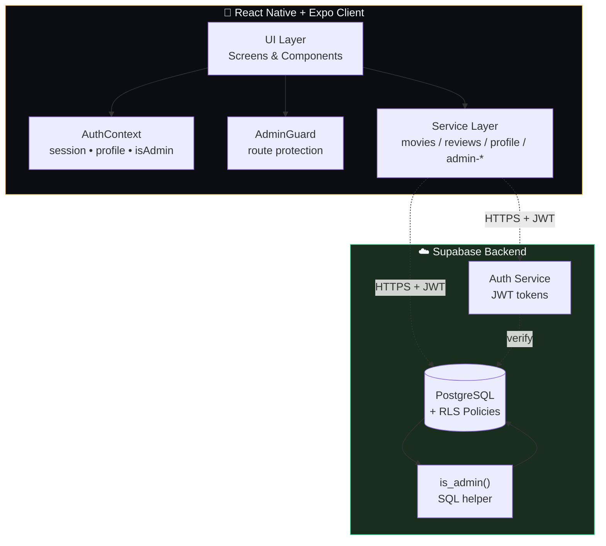
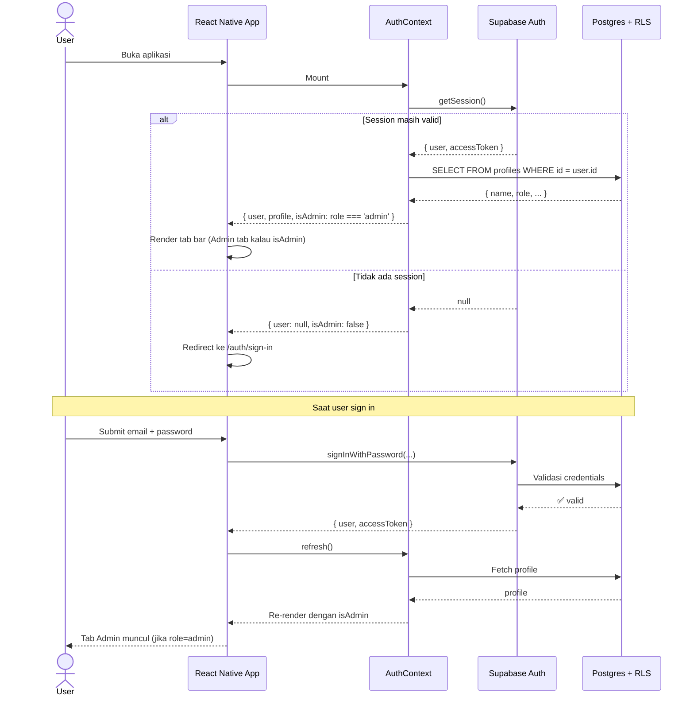

<div align="center">

# 🎬 MovieReview

**Aplikasi mobile review film cross-platform dengan admin panel terpadu**

[](https://expo.dev/)
[](https://reactnative.dev/)
[](https://www.typescriptlang.org/)
[](https://supabase.com/)
[](#-lisensi)

*Tugas Mata Kuliah — **Mobile App Development***

[Demo](#-demo--screenshots) • [Fitur](#-fitur) • [Arsitektur](#-arsitektur) • [Cara Menjalankan](#-cara-menjalankan) • [Pola Engineering](#-pola-engineering)

</div>

---

## ✨ Sorotan

> 🚀 **Production-grade patterns** — Stale-while-revalidate, optimistic UI dengan rollback, generation counter untuk async safety
>
> 🔒 **Database-level security** — Row-level security (RLS) dengan privilege escalation guard yang tidak bisa di-bypass dari client
>
> 🎯 **Type-safe end-to-end** — TypeScript strict mode, zero linting errors, full Supabase typing
>
> ⚡ **Polished UX** — Smooth animations dengan Reanimated, debounced search, error states dengan retry, modal flows yang ringan

---

## 📑 Daftar Isi

- [Demo & Screenshots](#-demo--screenshots)
- [Fitur](#-fitur)
- [Tech Stack](#-tech-stack)
- [Arsitektur](#-arsitektur)
- [Database Schema](#-database-schema)
- [Authentication Flow](#-authentication-flow)
- [Struktur Project](#-struktur-project)
- [Cara Menjalankan](#-cara-menjalankan)
- [Pola Engineering](#-pola-engineering)
- [Statistik Project](#-statistik-project)
- [Scripts](#-scripts)
- [Acknowledgments](#-acknowledgments)
- [Lisensi](#-lisensi)

---

## 🎥 Demo & Screenshots

> Tambahkan screenshot dan demo GIF setelah build production. Letakkan file di folder `docs/screenshots/`.

<table>
  <tr>
    <td align="center"><b>Home</b></td>
    <td align="center"><b>Detail Film</b></td>
    <td align="center"><b>Tulis Review</b></td>
  </tr>
  <tr>
    <td><i>docs/screenshots/home.png</i></td>
    <td><i>docs/screenshots/detail.png</i></td>
    <td><i>docs/screenshots/review.png</i></td>
  </tr>
  <tr>
    <td align="center"><b>Admin Hub</b></td>
    <td align="center"><b>Manage Movies</b></td>
    <td align="center"><b>Moderate Reviews</b></td>
  </tr>
  <tr>
    <td><i>docs/screenshots/admin-hub.png</i></td>
    <td><i>docs/screenshots/admin-movies.png</i></td>
    <td><i>docs/screenshots/admin-reviews.png</i></td>
  </tr>
</table>

---

## 📖 Ringkasan

MovieReview adalah aplikasi mobile yang memungkinkan pengguna untuk menemukan film, menulis review lengkap dengan rating dan tag, membangun watchlist pribadi, dan berinteraksi dengan katalog film yang terkurasi. Pengguna dengan role admin mendapat akses tambahan berupa control panel untuk mengelola katalog film dan memoderasi review yang dikirim user.

Project ini mendemonstrasikan pola pengembangan mobile production-grade: integrasi Supabase yang ter-typing rapi, row-level security, optimistic UI dengan rollback, paginated list, debounced search, serta role-based access control dengan navigasi tersembunyi.

---

## 🎯 Fitur

### Untuk Semua Pengguna
- **Autentikasi** — Sign up & sign in dengan email/password lewat Supabase Auth
- **Manajemen Profile** — Edit nama, username, bio, avatar, dan genre favorit
- **Jelajah Film** — Search, filter berdasarkan genre, halaman detail dengan cast, sinopsis, dan rating agregat
- **Featured Carousel** — Pilihan kurasi di home screen dengan visual yang kaya
- **Tulis Review** — Beri rating (1–5 bintang), judul + body, tag opsional, flag spoiler
- **Watchlist** — Simpan film untuk ditonton nanti, lihat di list khusus
- **Satu Review per Film per User** — Bisa di-edit, history edit ditampilkan via `updatedAt`

### Untuk Admin (Tab Tersembunyi)
- **Admin Hub** — Statistik live (movies, reviews, featured count) + kartu quick action
- **CRUD Film** — Create, edit, delete film dengan validasi form lengkap
- **Toggle Featured** — Switch on/off optimistic langsung dari list
- **Slug-based ID** — Dikunci saat edit untuk mencegah referensi rusak
- **Preview Gambar Live** — URL poster + backdrop dengan fallback error
- **Moderasi Review** — Paginated queue, filter berdasarkan judul film, delete dengan konfirmasi
- **Indikator Spoiler** — Tanda visual pada review yang ditandai mengandung spoiler

### Keamanan
- **Row-level security (RLS)** di semua tabel — write admin di-enforce di level database, bukan hanya client-side
- **Privilege escalation guard** — Update profile secara eksplisit tidak bisa mengubah kolom `role`
- **Route Tersembunyi** — Non-admin tidak akan pernah melihat tab Admin; percobaan deep-link akan di-redirect ke home screen via `AdminGuard`

---

## 🛠️ Tech Stack

| Layer | Teknologi |
|---|---|
| **Framework** | [Expo](https://expo.dev) (SDK 54) + [Expo Router](https://docs.expo.dev/router/introduction/) (file-based routing) |
| **Bahasa** | TypeScript (strict mode) |
| **UI** | React Native 0.81, [react-native-reanimated](https://docs.swmansion.com/react-native-reanimated/) v4 |
| **Backend** | [Supabase](https://supabase.com) (Postgres + Auth + RLS) |
| **State** | React Context + hooks (tanpa state library eksternal) |
| **Icons** | [@expo/vector-icons](https://icons.expo.fyi/) (Ionicons / MaterialIcons) |
| **Gambar** | [expo-image](https://docs.expo.dev/versions/latest/sdk/image/) untuk caching yang hemat memori |
| **Animasi** | Reanimated (entering animations, layout transitions, shared values) |
| **Storage** | [@react-native-async-storage/async-storage](https://github.com/react-native-async-storage/async-storage) untuk persistensi session |

---

## 🏗️ Arsitektur



**Prinsip kunci:**
- Client tidak pernah trust dirinya sendiri — semua write divalidasi di level database via RLS
- `AuthContext` adalah single source of truth untuk role; `AdminGuard` & `FloatingTabBar` membaca dari sini
- Service layer terpisah berdasarkan privilege (`movies.ts` publik vs `admin-movies.ts` admin-only)

---

## 🗄️ Database Schema

```mermaid
erDiagram
    auth_users ||--|| profiles : "1:1"
    profiles ||--o{ reviews : writes
    profiles ||--o{ watchlist : has
    movies ||--o{ reviews : receives
    movies ||--o{ watchlist : in

    auth_users {
        uuid id PK
        text email
    }

    profiles {
        uuid id PK_FK
        text name
        text username UK
        text bio
        text role "user|admin"
        text avatar_url
        timestamptz created_at
    }

    movies {
        text id PK "slug-style"
        text title
        text tagline
        int year
        int runtime_minutes
        text_array genres
        text director
        text synopsis
        text poster_url
        text backdrop_url
        decimal average_rating
        int review_count
        boolean is_featured
    }

    reviews {
        text id PK
        text movie_id FK
        uuid user_id FK
        text author_name
        int rating "1-5"
        text title
        text body
        text_array tags
        boolean contains_spoilers
        timestamptz created_at
        timestamptz updated_at
    }

    watchlist {
        bigint id PK
        uuid user_id FK
        text movie_id FK
        timestamptz added_at
    }
```

**Catatan penting:**
- `reviews.user_id` mereferensi `auth.users(id)`, **bukan** `profiles.id` — ini menyebabkan PostgREST tidak bisa auto-resolve embedded join `profiles(name)`. Solusi: manual `IN`-query lookup di `services/admin-reviews.ts`.
- `average_rating` & `review_count` di tabel `movies` adalah **derived columns** yang sengaja tidak di-expose ke admin form, supaya tidak ke-overwrite saat edit.

---

## 🔐 Authentication Flow



**Defense in depth:**
1. **Client-side**: `AdminGuard` component redirect non-admin user yang coba akses `/admin/*` route
2. **Network**: Setiap request ke Supabase mengirim JWT yang disinkronkan dengan auth state
3. **Database**: RLS policies di Postgres me-reject INSERT/UPDATE/DELETE dari user non-admin walaupun client-side bypass terjadi

---

## 📁 Struktur Project

```
MovieReview/
├── app/                          # Route file-based dari Expo Router
│   ├── (tabs)/                   # Route bottom-tab
│   │   ├── index.tsx             # Home (featured + sections)
│   │   ├── profile.tsx           # Profile + watchlist
│   │   └── admin.tsx             # Admin hub (gated)
│   ├── admin/                    # Layar khusus admin
│   │   ├── movies/
│   │   │   ├── index.tsx         # List film
│   │   │   ├── new.tsx           # Create film (modal)
│   │   │   └── [id].tsx          # Edit film (modal)
│   │   └── reviews.tsx           # Antrian moderasi review
│   ├── auth/                     # Flow sign in / sign up
│   ├── movies/                   # Jelajah film
│   │   ├── index.tsx             # Semua film + filter
│   │   └── [id].tsx              # Detail film + review
│   ├── profile/                  # Sub-screen profile
│   └── _layout.tsx               # Stack root
├── components/                   # Komponen UI yang dipakai bersama
│   ├── admin/                    # Khusus admin (guard, form)
│   ├── floating-tab-bar.tsx      # Tab bar custom dengan filter berdasarkan role
│   ├── rating-stars.tsx
│   └── ...
├── contexts/                     # React Context provider
│   └── auth-context.tsx          # Session, profile, isAdmin
├── data/
│   └── types.ts                  # Tipe domain bersama (Movie, Review, Profile)
├── hooks/                        # Custom hooks (theme, admin guard, dll.)
├── lib/
│   └── supabase.ts               # Client Supabase yang sudah ter-konfigurasi
├── services/                     # Lapisan akses database
│   ├── movies.ts                 # Query baca publik
│   ├── reviews.ts                # Write user-scoped + baca publik
│   ├── profile.ts                # CRUD profile (role di-strip)
│   ├── admin-movies.ts           # Operasi tulis admin
│   └── admin-reviews.ts          # Query moderasi admin
├── supabase/
│   ├── migrations/               # Migrasi SQL terversi
│   │   ├── 001_initial_schema.sql
│   │   ├── 002_profile_query_indexes.sql
│   │   ├── 003_profile_insert_own.sql
│   │   ├── 004_reviews_single_per_user_editable.sql
│   │   └── 005_admin_role.sql    # RLS + helper is_admin()
│   └── seed.sql                  # Sample film + review
├── theme/                        # Design tokens
└── package.json
```

---

## 🚀 Cara Menjalankan

### Prasyarat

- **Node.js** ≥ 20
- **npm** atau **pnpm**
- Aplikasi **Expo Go** di HP (iOS / Android), ATAU Android Studio / Xcode untuk emulator
- **Supabase project** (free tier sudah cukup)

### 1. Clone & Install

```bash
git clone <repo-url>
cd MovieReview
npm install
```

### 2. Konfigurasi Supabase

Buat file `.env` di root project:

```env
EXPO_PUBLIC_SUPABASE_URL=https://<your-project>.supabase.co
EXPO_PUBLIC_SUPABASE_ANON_KEY=<your-anon-key>
```

Ambil nilai keduanya dari dashboard Supabase → **Project Settings** → **API**.

### 3. Jalankan Migrasi

Di SQL editor Supabase, jalankan file migrasi **secara berurutan**:

```
supabase/migrations/001_initial_schema.sql
supabase/migrations/002_profile_query_indexes.sql
supabase/migrations/003_profile_insert_own.sql
supabase/migrations/004_reviews_single_per_user_editable.sql
supabase/migrations/005_admin_role.sql
```

Opsional: jalankan `supabase/seed.sql` untuk mengisi sample data film dan review.

### 4. Promote User Menjadi Admin

Setelah sign up lewat app, jalankan query berikut di SQL editor (ganti dengan UUID Anda):

```sql
-- Lihat semua profile + role
SELECT id, name, role FROM public.profiles;

-- Promote satu user menjadi admin
UPDATE public.profiles
SET role = 'admin'
WHERE id = '<uuid-anda>';
```

Restart aplikasi — tab **Admin** akan muncul di navigasi bawah.

### 5. Jalankan Aplikasi

```bash
npx expo start
```

Lalu pilih:
- **`a`** — Buka di emulator Android
- **`i`** — Buka di simulator iOS (hanya macOS)
- Scan QR code dengan **Expo Go** di perangkat fisik
- **`w`** — Buka di web browser (fitur terbatas)

---

## 🧩 Pola Engineering Utama

Project ini menerapkan beberapa pola yang dipakai di codebase production untuk memastikan keamanan, konsistensi, dan UX yang halus.

### 1. Generation Counter untuk Async Safety

Layar dengan pagination memakai generation counter berbasis `useRef` untuk membuang response fetch yang usang ketika user refresh di tengah-tengah scroll — mencegah korupsi data akibat resolusi async yang tidak berurutan.

```ts
// app/admin/reviews.tsx
const genRef = useRef(0);

useFocusEffect(useCallback(() => {
  const myGen = ++genRef.current;
  void getAllReviewsPaginated(0, PAGE_SIZE, filter)
    .then((result) => {
      if (myGen !== genRef.current) return; // discard stale
      setRows(result.reviews);
    });
}, [filter]));

async function loadMore() {
  const myGen = genRef.current; // capture (do NOT bump)
  const result = await getAllReviewsPaginated(page, PAGE_SIZE, filter);
  if (myGen !== genRef.current) return; // refresh happened mid-flight
  setRows((prev) => [...prev, ...result.reviews]);
}
```

### 2. Stale-While-Revalidate

List tetap menampilkan data yang sudah ada sambil melakukan refetch di background. Spinner loading hanya muncul saat first load saja — user tidak melihat layar putih saat balik dari halaman lain.

```ts
// app/admin/movies/index.tsx
const [loading, setLoading] = useState(true); // initial true

useFocusEffect(useCallback(() => {
  void getMovies()
    .then((all) => setMovies(all))
    .finally(() => setLoading(false)); // never set true again
}, []));
```

### 3. Optimistic UI dengan Rollback

Toggle featured di list film admin meng-update UI secara instan, lalu rollback kalau call ke server gagal.

```ts
// app/admin/movies/index.tsx
async function handleToggleFeatured(movie: Movie) {
  const next = !movie.isFeatured;
  setMovies((prev) => prev.map((m) =>
    m.id === movie.id ? { ...m, isFeatured: next } : m
  ));
  try {
    await toggleFeatured(movie.id, next);
  } catch (err) {
    // Rollback on failure
    setMovies((prev) => prev.map((m) =>
      m.id === movie.id ? { ...m, isFeatured: !next } : m
    ));
    Alert.alert('Failed', err.message);
  }
}
```

### 4. Manual Join saat PostgREST Tidak Bisa Resolve FK

`reviews.user_id` mereferensi ke `auth.users` (bukan `public.profiles`), sehingga PostgREST tidak bisa otomatis embed `profiles(name)`. Solusinya: dua-langkah lookup.

```ts
// services/admin-reviews.ts
const { data } = await supabase
  .from('reviews')
  .select('*, movies!inner(title)', { count: 'exact' })
  .order('created_at', { ascending: false });

const userIds = [...new Set(data.map((r) => r.user_id).filter(Boolean))];
const { data: profiles } = await supabase
  .from('profiles')
  .select('id, name')
  .in('id', userIds);

const profilesById = new Map(profiles.map((p) => [p.id, p.name]));
const reviews = data.map((row) => ({
  ...toReview(row),
  movieTitle: row.movies.title,
  authorName: profilesById.get(row.user_id) ?? row.author_name,
}));
```

### 5. Field Payload Kondisional

`toDbPayload` mengabaikan `average_rating` dan `review_count` dari payload kalau caller tidak mengirimnya — mencegah edit form mereset nilai-nilai turunan ke 0.

```ts
// services/admin-movies.ts
function toDbPayload(input: MovieInput): Record<string, unknown> {
  const payload: Record<string, unknown> = {
    id: input.id.trim(),
    title: input.title.trim(),
    // ... field lain
    is_featured: input.isFeatured ?? false,
  };
  // Conditional inclusion: undefined = preserved, defined = overwritten
  if (input.averageRating !== undefined) payload.average_rating = input.averageRating;
  if (input.reviewCount !== undefined) payload.review_count = input.reviewCount;
  return payload;
}
```

---

## 📊 Statistik Project

| Metrik | Jumlah |
|---|---:|
| 📱 Screens (TSX di `app/`) | **17** |
| 🧱 Reusable Components | **22** |
| ⚙️ Service Modules | **5** |
| 🗃️ Database Migrations | **5** |
| 🔒 RLS Policies | **8+** |
| 📦 Dependencies | **27** |
| ✅ TypeScript Strict | **100%** |
| 🐛 Lint Errors | **0** |

---

## 📜 Scripts

| Perintah | Fungsi |
|---|---|
| `npm start` / `npx expo start` | Menjalankan Metro bundler |
| `npm run android` | Buka di emulator Android |
| `npm run ios` | Buka di simulator iOS |
| `npm run web` | Buka di web browser |
| `npm run lint` | Jalankan ESLint |
| `npx tsc --noEmit` | Cek tipe tanpa emit file |

---

## 🙏 Acknowledgments

Project ini sangat terbantu oleh tools dan komunitas berikut:

- [**Expo**](https://expo.dev) — Toolchain React Native dengan DX yang luar biasa
- [**Supabase**](https://supabase.com) — Postgres + Auth + RLS dalam satu paket terintegrasi
- [**React Native Reanimated**](https://docs.swmansion.com/react-native-reanimated/) — Animasi 60fps via worklets
- [**Expo Router**](https://docs.expo.dev/router/introduction/) — File-based routing yang familiar dari Next.js
- [**@expo/vector-icons**](https://icons.expo.fyi/) — Library icon lengkap (Ionicons & MaterialIcons dipakai di project ini)

UI/UX inspiration dari **Letterboxd** dan **TMDB** untuk pola layout movie review yang sudah terbukti.

---

## 📄 Lisensi

Project ini dibuat untuk keperluan edukasi sebagai bagian dari mata kuliah **Mobile App Development**. Bebas digunakan sebagai referensi belajar, tapi mohon hargai effort dengan tidak mengklaim sebagai karya sendiri.

---

<div align="center">

*Made with ☕ and a healthy fear of regression bugs*

</div>
